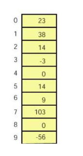
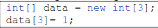
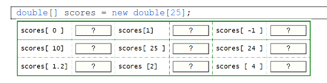
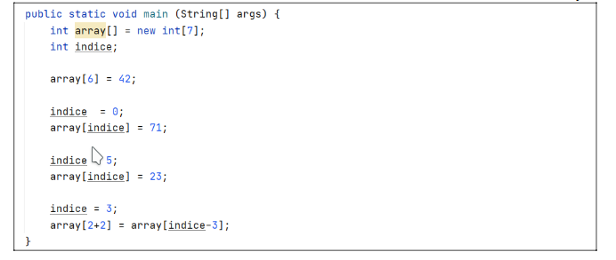
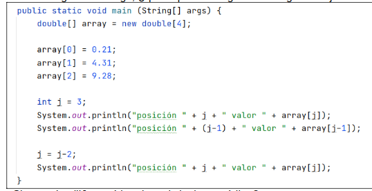
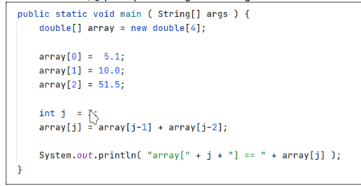
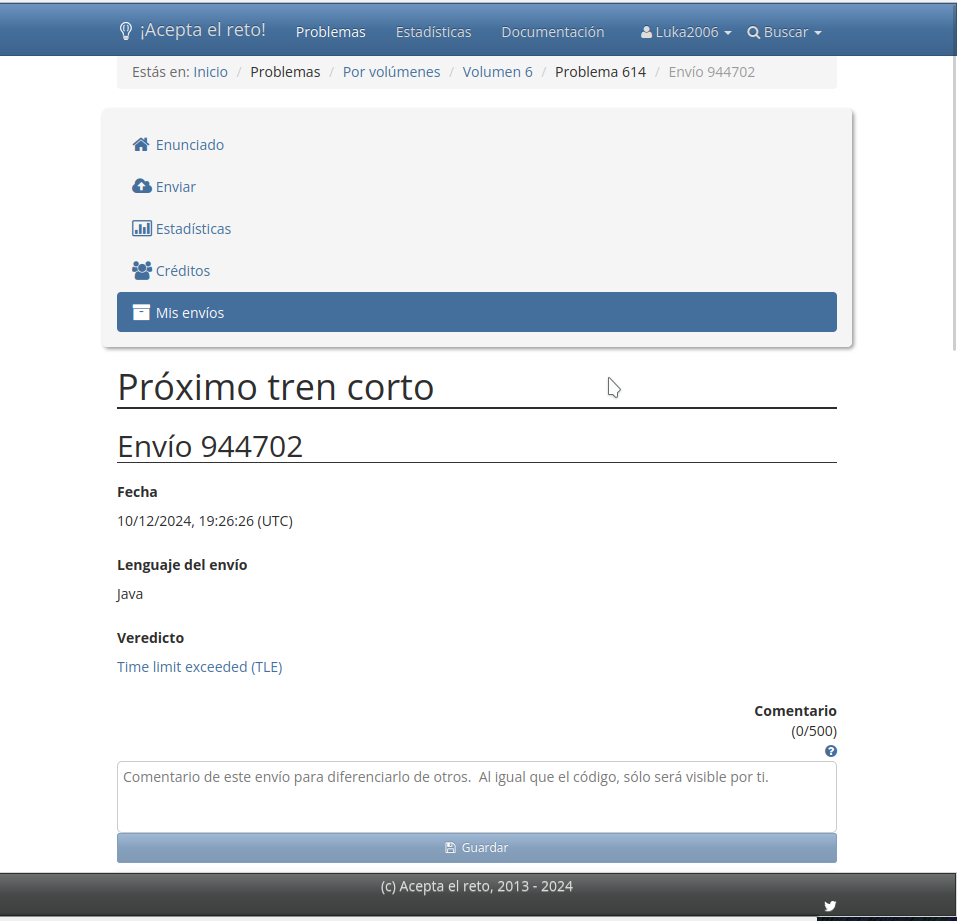

# Tarea 1
### Ejercicio 1

a. ¿Qué tamaño tiene el array?

Tiene un tamaño 10.

b. ¿De qué tipo de dato es el array?

Tipo Integer.

c. ¿Qué devuelve array[7]?

Devuelve 103.

d. ¿Cómo hago para acceder al cuarto valor del array?

array[3]

e. Crea una definición del array en una sola línea de código.

Conjunto de datos de un mismo tipo ordenados por posición.

f. ¿Cómo hago para modificar el valor de la décima posición y
asignarle 2?

array[9] = 2;

g. ¿Qué devolvería la expresión array[1] + array[5]?

Devuelve 52.

h. ¿Qué hace la expresión array[6]++?

Suma 1 a la cantidad que haya en el séptimo valor.

i. ¿Qué realiza la siguiente expresión: array[0] = array[14] + 10;

Asigna en el primer valor la suma de valor número 13 más 10.

### Ejercicio 2

a. ¿Cuál es la longitud del array?

Longitud 3.

b. ¿Cuáles es su índice superior?

Su índice superior es 2.

c. ¿Qué sucede al ejecutar el código?

Dará error porque pone la posición 3, la cual no existe.

### Ejercicio 3

scores[0] Correcto

scores[1] Correcto

scores[-1] Incorrecto, no hay posiciones negativas.

scores[10] Correcto

scores[25] Incorrecto, el índice superior llega hasta 24.

scores[24] Correcto

scores[1.2] Incorrecto, las posiciones son enteros, no decimales.

scores[2] Correcto

scores[4] Correcto

### Ejercicio 4

0 -> 71

1 -> 0

2 -> 0

3 -> 0

4 -> 71

5 -> 23

6 -> 42

### Ejercicio 5

0 -> 0.21

1 -> 4.31

2 -> 9.28

3 -> 0

Output:

posición 3 valor 0
posición 2 valor 9.28
posición 1 valor 4.31

### Ejercicio 6

0 -> 5.1

1 -> 10.0

2 -> 51.5

3 -> 61.5

array[3] == 61.5

### Ejercicio 7

char dam[3] = {'d','a','m'};

a. ¿De qué tamaño es el array?

Tamaño 3.

b. ¿Qué valor tiene la segunda posición?

a

c. ¿Qué valor tiene dam[3]?

Nada, no existe esa posición.

### Ejercicio 8

char[3] dam = {'d','a','m'};

### Ejercicio 9

dataA 12,23,45,56
dataB 45,23,0,45,0,12

dataB 45,23,0,45,0,12

## Reto 614

